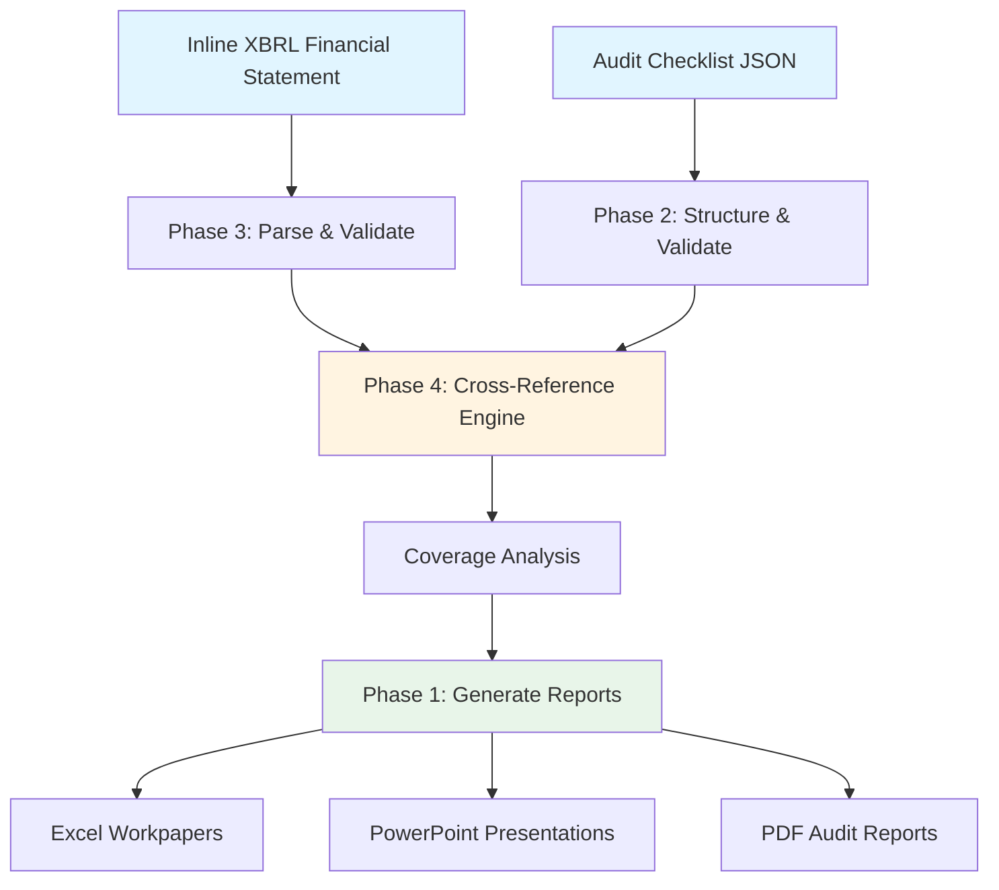

# Skills for Audit

[](https://www.python.org/downloads/)
[](https://www.anthropic.com/)
[](LICENSE)
[](CONTRIBUTING.md)

A comprehensive learning path for applying Anthropic's Claude Skills to financial audit workflows, designed for accounting professors, audit regulators, and practitioners.

> **🎓 Educational Purpose**: This repository provides teaching materials and proof-of-concept demonstrations. It is not intended to replace professional judgment in actual audit engagements.

## ⭐ Quick Links

- **[Quick Start Guide](QUICK_START.md)** - Get running in 15 minutes
- **[Learning Roadmap](AUDIT_SKILLS_ROADMAP.md)** - 10-week curriculum
- **[Contributing](CONTRIBUTING.md)** - How to contribute
- **[Discussions](https://github.com/GenAICPA/SkillsforAudit/discussions)** - Ask questions and share ideas

## Project Goals

Build progressive understanding of Claude Skills by creating an end-to-end audit assistant that:
- Manages audit checklists with structured data (JSON)
- Generates professional audit workpapers (Excel, PowerPoint, PDF)
- Parses and validates Inline XBRL financial statements
- Cross-references audit procedures with XBRL data points
- Demonstrates AI-assisted audit workflows for educational and regulatory audiences

### Architecture Overview



## Repository Structure

```
skills/
├── phase1_foundations/          # Basic Skills API usage
│   ├── 01_basic_pptx.py        # PowerPoint generation
│   ├── 02_basic_xlsx.py        # Excel workpaper templates
│   └── 03_code_execution_pattern.py  # Code + Skills integration
│
├── phase2_structured_data/      # JSON/XML audit data models
│   ├── 04_audit_checklist_model.py   # Define data structures
│   ├── 05_json_validation.py         # Validate audit data
│   └── 06_checklist_to_excel.py      # Generate workpapers from data
│
├── phase3_xbrl/                 # XBRL parsing and validation
│   ├── 07_parse_ixbrl.py       # Extract XBRL data
│   ├── 08_validate_ixbrl.py    # Validation rules
│   └── 09_ixbrl_analytics.py   # Analytical procedures
│
├── phase4_cross_reference/      # Link procedures to data
│   ├── 10_cross_reference_engine.py  # Core linking logic
│   ├── 11_coverage_analysis.py       # Audit gap identification
│   └── 12_traceability_report.py     # Audit trail documentation
│
├── phase5_prototype/            # Integrated demonstration
│   └── prototype_audit_assistant.py  # Complete workflow
│
├── sample_data/                 # Example audit files
│   ├── sample_ixbrl/           # Inline XBRL filings
│   ├── audit_checklists/       # JSON audit programs
│   └── evidence/               # Sample audit evidence
│
└── AUDIT_SKILLS_ROADMAP.md     # Detailed learning plan
```

## Quick Start

### Prerequisites

```bash
# Install required packages
pip install anthropic

# Set up your API key
export ANTHROPIC_API_KEY='your-key-here'  # Linux/Mac
# or
set ANTHROPIC_API_KEY=your-key-here       # Windows
```

### Phase 1: Basic Skills (Start Here)

```bash
cd phase1_foundations

# Generate an audit presentation
python 01_basic_pptx.py

# Create an Excel bank reconciliation workpaper
python 02_basic_xlsx.py

# Use code execution with Skills for sampling calculations
python 03_code_execution_pattern.py
```

### Phase 2: Structured Data

```bash
cd phase2_structured_data

# Create sample audit checklist (JSON)
python 04_audit_checklist_model.py

# Validate the checklist structure
python 05_json_validation.py

# Generate Excel workpaper from checklist
python 06_checklist_to_excel.py
```

### Phase 3-5: Advanced Topics (Coming Soon)

XBRL integration, cross-referencing, and complete prototype demonstrations.

## Key Concepts

### Audit Checklist Data Model

Structured JSON representing:
- **Audit procedures**: What needs to be tested
- **Status tracking**: not_started, in_progress, completed
- **Evidence references**: Links to supporting documentation
- **XBRL references**: Which financial statement elements are tested
- **Sign-offs**: Auditor, date, notes, exceptions

Example structure:
```json
{
  "audit_engagement": {
    "client": "Example Corp",
    "period_end": "2024-12-31",
    "sections": [
      {
        "section_id": "AS.2201",
        "name": "Revenue Recognition",
        "risk_level": "high",
        "procedures": [
          {
            "procedure_id": "REV-001",
            "description": "Test sales cutoff",
            "status": "completed",
            "xbrl_refs": ["us-gaap:RevenueFromContractWithCustomerExcludingAssessedTax"],
            "evidence_refs": ["WP-A1"],
            "sign_off": {
              "auditor": "Emily Rodriguez, CPA",
              "date": "2025-02-15"
            }
          }
        ]
      }
    ]
  }
}
```

### Skills Integration Pattern

All examples follow this pattern:

```python
import anthropic

client = anthropic.Anthropic()

response = client.beta.messages.create(
    model="claude-haiku-4-5-20251001",
    max_tokens=4096,
    betas=["code-execution-2025-08-25", "skills-2025-10-02", "files-api-2025-04-14"],
    container={
        "skills": [
            {
                "type": "anthropic",
                "skill_id": "xlsx",  # or "pptx", "pdf"
                "version": "latest"
            }
        ]
    },
    tools=[
        {
            "type": "code_execution_20250825",
            "name": "code_execution"
        }
    ],
    messages=[{"role": "user", "content": "Your prompt here"}]
)

# Extract file_id and download
for block in response.content:
    if hasattr(block, 'file_id') and block.file_id:
        file_content = client.beta.files.retrieve_content(block.file_id)
        with open('output.xlsx', 'wb') as f:
            f.write(file_content)
```

## Learning Path

### For Students/Professors

1. **Week 1-2**: Master basic Skills API (Phase 1)
   - Understand document generation workflows
   - Learn file handling patterns
   - Practice with audit-specific examples

2. **Week 3-4**: Work with structured audit data (Phase 2)
   - Define JSON schemas for audit programs
   - Validate data quality
   - Automate workpaper generation

3. **Week 5-6**: XBRL financial statement analysis (Phase 3)
   - Parse Inline XBRL documents
   - Extract and validate financial data
   - Perform analytical procedures

4. **Week 7-8**: Build cross-reference systems (Phase 4)
   - Link procedures to evidence to XBRL facts
   - Analyze audit coverage
   - Generate traceability reports

5. **Week 9-10**: Integrated demonstration (Phase 5)
   - Complete end-to-end audit workflow
   - Present to stakeholders
   - Discuss regulatory implications

### For Regulators

Focus areas:
- **Audit trail transparency**: How AI-assisted procedures are documented
- **Data validation**: Quality controls and validation logic
- **Compliance**: Alignment with PCAOB/AICPA standards
- **Explainability**: Understanding AI decision-making in audit context

See `regulatory_documentation.md` (forthcoming) for detailed compliance mapping.

## Use Cases

### 1. Audit Program Management
- Generate customizable audit programs from templates
- Track procedure completion in real-time
- Automate status reporting

### 2. XBRL Financial Analysis
- Extract data from SEC filings automatically
- Validate mathematical relationships
- Identify unusual trends or outliers

### 3. Audit Documentation
- Generate workpapers from structured data
- Create presentation materials for audit committees
- Produce final audit reports (PDF)

### 4. Cross-Reference & Coverage
- Map which XBRL elements are tested by procedures
- Identify untested financial statement items
- Ensure comprehensive audit coverage

## 🚀 Development Status

| Phase | Status | Description |
|-------|--------|-------------|
| Phase 1 | ✅ Complete | Basic Skills API (PPTX, XLSX generation) |
| Phase 2 | ✅ Complete | Structured audit data (JSON checklists) |
| Phase 3 | ✅ Core Complete | XBRL parsing and validation |
| Phase 4 | ⏳ Planned | Cross-reference engine (procedures ↔ XBRL) |
| Phase 5 | ⏳ Planned | Integrated prototype demonstration |

## 🤝 Contributing

We welcome contributions from educators, practitioners, and developers! See [CONTRIBUTING.md](CONTRIBUTING.md) for guidelines.

**Ways to contribute:**
- 📚 Share classroom materials or teaching experiences
- 🔍 Add audit procedure examples (anonymized)
- 💻 Implement Phase 4-5 features
- 📖 Improve documentation
- 🐛 Report bugs or suggest enhancements

## 📚 Resources

### Anthropic & AI
- [Anthropic Skills API Documentation](https://docs.anthropic.com)
- [Claude Code](https://claude.ai/code)

### Audit Standards
- [PCAOB Auditing Standards](https://pcaobus.org/standards)
- [AICPA Audit Standards](https://www.aicpa.org/research/standards)
- [IAASB International Standards on Auditing](https://www.iaasb.org/)

### XBRL & Financial Reporting
- [XBRL US GAAP Taxonomy](https://xbrl.us/home/filers/sec-reporting/)
- [SEC EDGAR Database](https://www.sec.gov/edgar)
- [XBRL International](https://www.xbrl.org/)

## 📄 License

This project is licensed under the MIT License - see the [LICENSE](LICENSE) file for details.

**Educational Disclaimer**: This software is for educational and research purposes only. Not intended to replace professional judgment in audit engagements. Users must comply with applicable professional standards.

## 📧 Contact & Support

- **Issues**: [GitHub Issues](https://github.com/GenAICPA/SkillsforAudit/issues)
- **Discussions**: [GitHub Discussions](https://github.com/GenAICPA/SkillsforAudit/discussions)
- **Questions**: Open a discussion or review existing documentation

## 🌟 Acknowledgments

Built with [Claude](https://www.anthropic.com/) by GenAICPA for the advancement of audit education and practice.

## 📖 Citation

If you use this project in academic work, please cite:

```bibtex
@software{skills_for_audit_2025,
  author = {GenAICPA},
  title = {Skills for Audit: AI-Assisted Financial Audit Workflows},
  year = {2025},
  url = {https://github.com/GenAICPA/SkillsforAudit},
  note = {Educational toolkit for Claude Skills in audit applications}
}
```

---

**⚠️ Important**: Never commit real client data or API keys. See [CONTRIBUTING.md](CONTRIBUTING.md) for data privacy guidelines.
